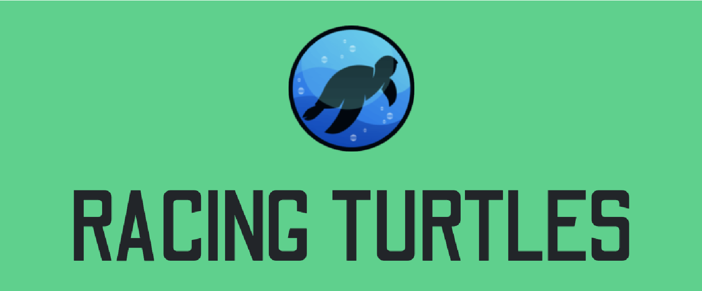
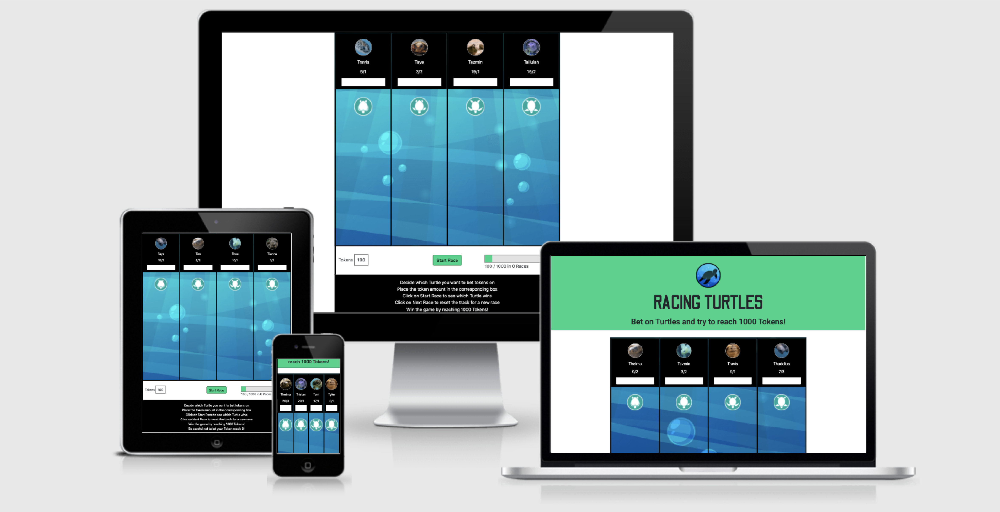
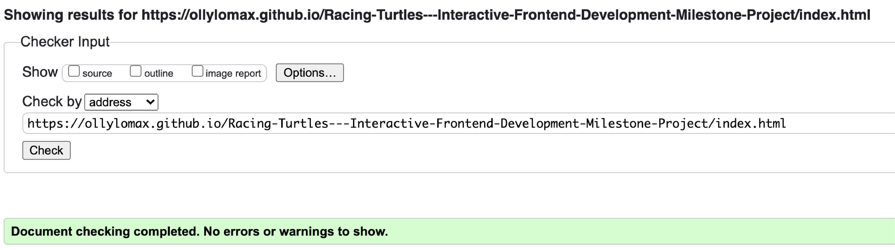
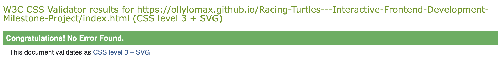
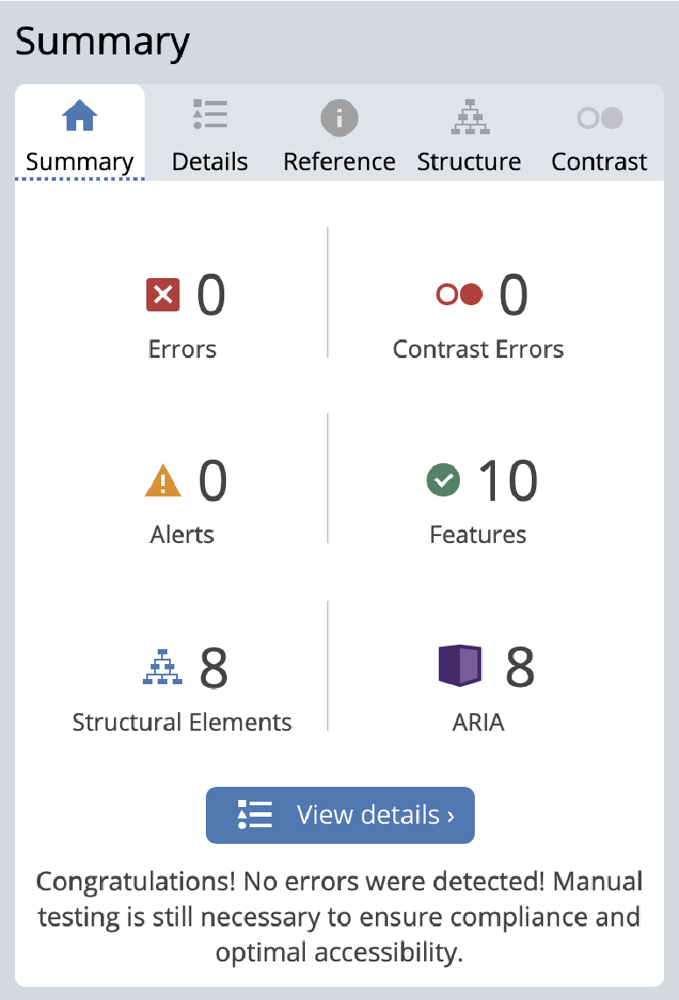
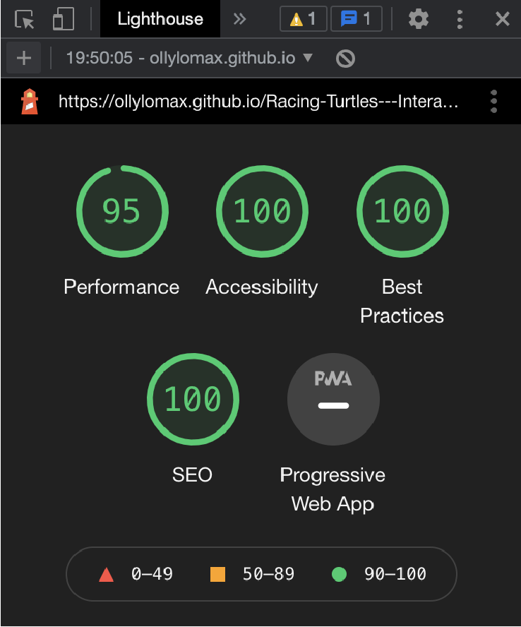
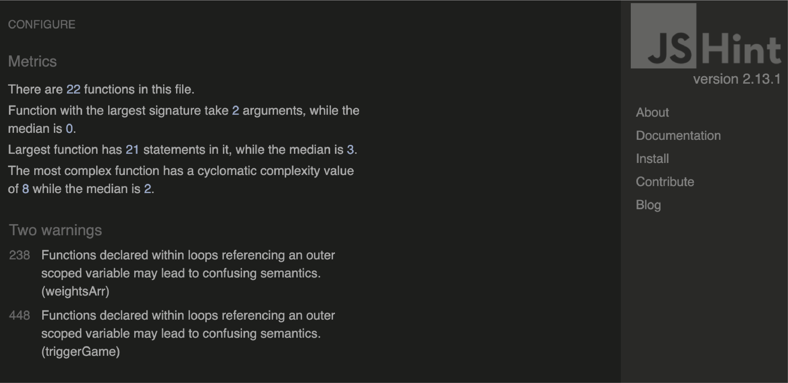
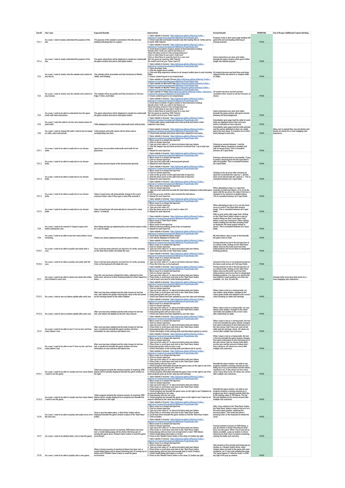

<h1 align="center">Interactive-Frontend-Development-Milestone-Project/ (Milestone Project #2)</h1>
<h1 align="center">Olly Lomax</h1>

<h2 align="center"></h2>

# Racing Turtles Website
I made this website using my knowledge of HTML5, CSS3, JavaScript, jQuery and Bootstrap frameworks as well as UX Design which I have learned from Code Institute during my Diploma in Full Stack Software Development. I made this interactive game with the intention of completing my Interactive Frontend Development Milestone Project.

View the live project [here](https://ollylomax.github.io/Racing-Turtles---Interactive-Frontend-Development-Milestone-Project/index.html).

### Goals
  - To show what I have learned so far with HTML5, CSS3, JavaScript and Bootstrap and jQuery frameworks.
  - To provide a fun and interactive game to play that users will enjoy.
  - To show clear win and lose scenarios.
  - To make a game with replayability that users will want to play multiple times.
  - To make a game that users will want to return to the website in order to play again.

## UX STRATEGY

- ### User Stories

    - As a user, I want to easily understand the purpose of the site.

    - As a user, I want to clearly view the website and content on any device.

    - As a user, I want to clearly view the website and content on any browser.

    - As a user, I want to be able to understand how the game works with clear instructions.

    - As a user, I want to see the odds clearly displayed for each turtle.

    - As a user, I want to choose the turtle I want to bet on based on odds, name and portrait.

    - As a user, I want to be able to easily bet on my chosen turtle.

    - As a user, I want to be warned if I forgot to input a bid before starting the race.

    - As a user, I want to be able to see how many tokens I have remaining.

    - As a user, I want to be able to quickly and easily start the race.

    - As a user, I want to be able to clearly see where the turtles have finished in each race.

    - As a user, I want to see my tokens update after each race.

    - As a user, I want to be able to see if I win my bet, and how many tokens I won.

    - As a user, I want to be able to see if I lose my bet, and how many tokens I lost.

    - As a user, I want to be able to visually see how many tokens I need to win the game.

    - As a user, I want to be able to quickly and easily move on to the next race.

    - As a user, I want to be alerted when I win or lose the game.

    - As a user, I want to be able to quickly start a new game.

## UX SCOPE

- ### Planned Features

    - Page heading and logo to be visually appealing and provide a short description of what the game is about.
    - An interactive turtle racing game using imaginary tokens to bet with.
    - Clear instructions on how to play the game.
    - Randomised turtle portraits and names.
    - Randomised betting odds with correctly weighted race outcomes.
    - Input field for each turtle to place bets within, with restrictions on input
    - Start race button.
    - Finishing positions displayed clearly with turtle icons in their respective lanes.
    - User tokens value displayed clearly.
    - Visual progress bar showing progress towards winning scenario.
    - Shake effect on user tokens value when value changes with bets.
    - Next race button.
    - Alert popup to tell user if they have forgotten to input a bet.
    - Clearly display which turtle has won the race and if the turtle the user bet on won or lost.
    - Clearly display token gains and losses through betting outcomes.
    - Modal dialogs announcing Win/Loss game scenarios to the user.
    - GitHub profile and repos shown in footer.

## UX STRUCTURE

### User Story:
> As a user, I want to easily understand the purpose of the site.

- #### Acceptance Criteria:
    - Aesthetically pleasing logo of a turtle displayed.
    - Heading displayed with ’Racing Turtles’.
    - Sub-heading displayed with ‘Bet on Turtles and try to reach 1000 Tokens!’

 - #### Description:
    The logo, page heading and sub-heading clearly display to users the main purpose of the webpage immediately on page load.

### User Story:
> As a user, I want to clearly view the website and content on any device.

- #### Acceptance Criteria:
    The layout of the website is well structured, clearly readable and aesthetically pleasing across all viewports and devices.

- #### Description:
    Utilising rows and columns within Bootstrap frameworks and mobile first design will be used when coding the project and testing will be required to ensure the layout is clear on all devices. No elements should overlap their containers and all items should be responsive so that no elements are too large to display properly.

### User Story:
> As a user, I want to be able to understand how the game works with clear instructions.

- #### Acceptance Criteria:
    Instructions will be shown to the user before any action in required.

 - #### Description:
    Itemised game instructions outlined in results box before each race has been initiated.

### User Story:
> As a user, I want to see the odds clearly displayed for each turtle.

- #### Acceptance Criteria:
    User can clearly see the odds for each turtle to be able to make a decision on their bet.

 - #### Description:
    Random odds will be generated and shown for each turtle beneath their portrait and above their race lane.

### User Story:
> As a user, I want to choose the turtle I want to bet on based on odds, name and portrait.

- #### Acceptance Criteria:
    User will be shown a picture of the turtle, his/her name and betting odds in order for them to be comfortable with their choice.

 - #### Description:
    Turtle portraits and names will be randomly assigned to each name and be clearly displayed alongside their respective odds to win the race.

### User Story:
> As a user, I want to be able to easily bet on my chosen turtle.

- #### Acceptance Criteria:
    User able to distinguish between betting boxes relevant to the turtle they wish to bet on and input the tokens they desire.

 - #### Description:
    Input fields will be provided and clearly displayed beneath the portrait, name and odds of the relevant turtle.

### User Story:
> As a user, I want to be warned if I forgot to input a bid before starting the race.

- #### Acceptance Criteria:
    User will be alerted if they try to start a race without making a bet on a turtle

 - #### Description:
    An alert dialog will pop on screen if the start race button is clicked or if the keyboard Enter key is pressed while in a bet field without a bet entered.

### User Story:
> As a user, I want to be able to see how many tokens I have remaining.

- #### Acceptance Criteria:
    User will be shown the total amount of tokens they have at all stages throughout the game.

 - #### Description:
    A box containing an interactive display of user tokens is displayed underneath the game window in bold.

### User Story:
> As a user, I want to be able to quickly and easily start the race.

- #### Acceptance Criteria:
    User can initiate the race to begin.

 - #### Description:

    ’Start Race’ button will be provided underneath the game window and the keyboard Enter key will also initiate the race if a bet has been entered into bet field.

### User Story:
> As a user, I want to be able to clearly see where the turtles have finished in each race.

- #### Acceptance Criteria:
    User can see on the race track where each turtle finished in the race.

 - #### Description:
    In each lane the turtle icons are displayed in their designated position in which they finished the race, from 1st to 4th.

### User Story:
> As a user, I want to see my tokens update after each race.

- #### Acceptance Criteria:
    User’s attention will be directed towards their tokens value when a race is complete.

 - #### Description:
    User tokens value will shake with a css effect and briefly change colour corresponding to gaining (green) or losing (red) tokens after a race has finished.

### User Story:
> As a user, I want to be able to see if I win my bet, and how many tokens I won. 
> As a user, I want to be able to see if I lose my bet, and how many tokens I lost.

- #### Acceptance Criteria:
    User will be clearly informed of race outcome, including winning turtle, whether their turtle won as well as exact token gains and losses.

 - #### Description:
    A results box is provided for the user which displays:

    - The winning turtle.
    - Whether the chosen turtle to bet on has won or not.
    - If their turtle won, the amount of tokens gained is shown.
    - If their turtle didn’t win, the amount of tokens lost is shown.

### User Story:
> As a user, I want to be able to visually see how many tokens I need to win the game.

- #### Acceptance Criteria:
    User will be shown current progression towards winning the game both informatively and visually.

 - #### Description:
    Textual values are shown beneath the game window of current tokens compared to the 1000 tokens required to win the game.

    An interactive progression bar is also shown in the same position, giving the user a visual representation of progress towards a winning outcome.

### User Story:
> As a user, I want to be able to quickly and easily move on to the next race.

- #### Acceptance Criteria:
    User can move onto the next race and decide on their next bet.

 - #### Description:
    A ’Next Race’ button replaces the ‘Start Race’ button after it is clicked underneath the game window.

### User Story:
> As a user, I want to be alerted when I win or lose the game.

- #### Acceptance Criteria:
    User will be alerted upon winnings and losing scenarios.

 - #### Description:
    Modal popups are initiated when winning or losing scenarios have been met, informing the user of the outcome.

### User Story:
> As a user, I want to be able to quickly start a new game.

- #### Acceptance Criteria:
    After a game as been won or lost, user will easily be able to restart the game to play again.

 - #### Description:
    Restart button provided on modal dialogs which restarts the game completely. Closing the modals using the ‘x’ at the top right has the same effect.

## UX SKELETON

- ### Wireframes

    - Home (desktop)
    

    - Home (mobile)
    

## UX SURFACE

- ### Colour Scheme

    
    
    

    I used three main colours for the website. A Cyan for the main theme, as well as Black and White for contrast. I felt like they complimented each other well, related well to the turtle theme and provided the necessary contrast to use exclusively throughout the design process.

- ### Typography
    I used two main fonts for the website, Odibee, a gaming themed font, for the main heading and Roboto for all content which is well recognised and a standard in web design.

- ### Imagery
    I sourced the Racing Turtles main logo, the turtle race icons and the race background from licensed images on a Shutterstock free trial which are free for personal and commercial use. The turtle portrait images were taken from Unsplash which is a free resource for stock images. Using my knowledge of Adobe Photoshop and Illustrator, all images have been selected and edited/exported with as much uniformity as possible and downsampled to decrease page load times.

- ### Notable amendments to Design

    - In contrast to my wireframes, I decided to keep the flow of race tracks in a vertical direction for both desktop and mobile. The reasons for this were twofold:
        
        - The heavy css and html changes required would not have been a productive use of time on an already tight schedule.
        - Upon reflection, I liked the flow of the race track in its current state on desktop and realised changing it would be unnecessary having already showcased my solid understanding of media queries in my previous project.
        
    - In contrast to my wireframes, I decided not to include the ‘Email Results’ email input on the desktop site. I had intended to hook this up to an API where the user, upon winning the game, could request a basic email showing how many tokens they won and how many races it took to do so. The reasons for this were twofold:

        - I had already coded a walkthrough project where I hooked up a simple email API and felt that this wasn’t going to showcase any further skills.
        - I felt that this feature did not have any other purpose other than to show I can hook up a basic email API, moreover it did not tie in with the theme of the site.
    
     - In contrast to my wireframes, I decided that instead of having two buttons ('Start Race' and 'Next Race') being displayed at all times, that I would have them replace each other between races. I did this because:
        - It provides a better user experience, as the 'Start Race' button would not have any functionality between race outcomes.
        - I did not want the user to be able to cycle through betting odds, by repeated use of the 'Next Race' button, until a desirable set of odds is found. This did not seem conducive to a random, but fair game.

## Features

- ### Current

    - Responsive across all viewports using bootstrap classes.
    - Page heading and logo.
    - Clear instructions on how to play the game.
    - Turtle portrait and names.
    - Correctly weighted odds for each turtle.
    - User inputs with restrictions.
    - Start race and Next race buttons.
    - Turtle icons in start positions in respective lanes.
    - Turtle icons in finishing positions in respective lanes. (Upon clicking Start Race button).
    - User tokens and progress towards the winning scenario of 1000 tokens.
    - Progress bar towards aforementioned winning scenario.
    - User token shake effect (Upon the gaining or losing of Tokens).
    - Alert popup informing user to place a bet (If no bets are input).
    - Textual results informing user about race winner and tokens lost/gained.
    - Modal dialogs telling user they have won/lost (Upon winning/losing scenarios).
    - Footer with GitHub profile and links to my repos.

- ### Prospective

    - Animate the turtles down their lanes, setting varying interval steps for each turtle.
    - The project is future scoped for the easy addition of more lanes and more turtles.
    - Change Win/Loss scenario from reaching a set number of tokens, to playing against the ‘computer’ with randomised choices.
    - Allow users to upload their own pet names and images to race with.

## Technologies Used

-   ### Languages
    - [HTML5](https://en.wikipedia.org/wiki/HTML5) 
        The language used to display content and provide structure.
    - [CSS3](https://en.wikipedia.org/wiki/Cascading_Style_Sheets) 
        I used custom styling on top of Bootstrap frameworks.
    - [JavaScript](https://en.wikipedia.org/wiki/JavaScript) 
        I used heavy custom JavaScript for game functionality with jQuery.

-   ### Frameworks, Libraries & Programs
    - [Bootstrap v5.1.3](https://getbootstrap.com/docs/4.6/getting-started/introduction/) 
        Framework used throughout the site to provide baseline styling and import JavaScript/jQuery.
    - [Google Fonts](https://fonts.google.com/) 
        Used to import the two fonts used throughout the website: Odibee and Roboto.
    - [Font Awesome](https://fontawesome.com/) 
        Used only for the GitHub icon which I added to the footer.
    - [jQuery](https://jquery.com/) 
        Used throughout the JavaScript coding of the game.
    - [Git](https://git-scm.com/) 
        Used for version control to commit and push code via Gitpod to the GitHub repository where the source code is stored.
    - [Gitpod](https://www.gitpod.io/) 
        This is the IDE (Integrated Development Environment) I used to build the website and commit to Git and push to GitHub
    - [GitHub](https://github.com/) 
        GitHub is used to store the projects code after being pushed from Git and to host the deployment of the live site via GitHub Pages.
    - [Adobe Photohop](https://www.adobe.com/uk/products/photoshop.html) 
        Used to convert and resize images before uploading to local repositry.
    - [Adobe Illustrator](https://www.adobe.com/uk/products/illustrator.html) 
        Used to edit logo and export documents before uploading to local repositry.
    - [Balsamiq](https://balsamiq.com/) 
        Used during the scoping process to visualise the basic structure of the website and create wireframes during the Skeleton phase of UX Design.

-   ### Resources, Tools & Diagnostics
    - [Unsplash](https://unsplash.com/) 
        Free stock image database used for turtle portrait imagery.
    - [Shutterstock](https://www.shutterstock.com) 
        Paid stock photo database which I used for website logo, turtle icons and race background. All images are licenced under the free trial of 10 image downloads.
    - [TinyJPG](https://tinyjpg.com) 
        Used to downsample images to smaller file sizes in order to increase load times and reduce storage requirements.
    - [cloudconvert](https://cloudconvert.com) 
        Used to convert race background image for mobile to the smallest file size possible to reduce data usage on mobile devices.
    - [Favicon.io](https://favicon.io/) 
        Used in the creation of the website Favicon across all pages.
    - [Chrome DevTools](https://developer.chrome.com/docs/devtools/) 
        Used  throughout the design process for debugging purposes in console.
    - [Safari Web Inspector](https://developer.apple.com/safari/tools/) 
        Used as above for cross-browser support.
    - [Firefox Developer Tools](https://developer.mozilla.org/en-US/docs/Tools) 
        Used as above for cross-browser support.
    - [Am I Responsive?](http://ami.responsivedesign.is/) 
        Used to create a website mock-up image across different sized devices to showcase viewport responsiveness.
    - [WAVE](https://wave.webaim.org/) 
        Used for diagnostic contrast testing.
    - [Lighthouse](https://developers.google.com/web/tools/lighthouse) 
        Used for diagnostic performance, accessibility and SEO testing.
    - [W3C Markup Validation Service](https://validator.w3.org/) 
        HTML Validator used to validate every page of the project to ensure there were no syntax errors.
    - [W3C CSS Validation Service](https://jigsaw.w3.org/css-validator/) 
        CSS Validator used to ensure there were no syntax errors in styling.
    - [JSHint](https://jshint.com/) 
        JavaScript tool to check for errors and potential problems in my JavaScript code

## Testing
- The W3C Markup Validator and W3C CSS Validator Services were used to validate the project to ensure there were no syntax errors. Both returned **no errors** for every page.

- WAVE, a Web Accessibility Evaluation Tool was used for contrast testing and returned **no contrast errors** for every page.
 

- Lighthouse was used for performance, accessibility and SEO testing and returned a score of **95-100** after generating 10+ reports for Desktop and Mobile. 
 

- JSHint, a JavaScript Static Code Analysis Tool was used to check the coherence and quality of my code, making sure it is error free and that no potential problems exist.

  Though my code is error and problem free, there were two warnings remaining that I thoroughly troubleshooted but could not find a solution for under a tight schedule. They don't however compromise any functionality of the game and both snippets of code have intentional purpose.
 

- I ran the website locally and tested on the deployed version. No differences found.

## Test Strategy
 - The testing will be predominantly performed on the functionality of the game, in addition to the aesthetics and layout of the page.

    This will be done on four web browsers:-
    - Chrome
    - Firefox
    - Safari
    - Edge

    And on every common breakpoint (Mobile, Tablet, Desktop, XL Desktop).

 - Validation of feature inclusion will be undertaken from the wireframes scoped during the Skeleton stage of UX design.
 
 - Elements should not overlap other container divs and should remain on the screen at all sizes above and including 300px.

 - Validation of bet inputs and token distribution will be undertaken thoroughly to ensure the calculations are working perfectly.

 - My GitHub repositry link should open in a new browser window.

The live project is deployed [here](https://ollylomax.github.io/Racing-Turtles---Interactive-Frontend-Development-Milestone-Project/index.html).

## User Story Testing

> As a user, I want to easily understand the purpose of the site.

 - The purpose of the website is promoted in the title and sub-heading indicating that it is a game.

 - The game instructions will be displayed in results box underneath the game window and next to start game button.

> As a user, I want to clearly view the website and content on any device.

  - The website will be accessible and fully functional on Mobile, Tablet, and Desktop.

> As a user, I want to clearly view the website and content on any browser.

 - The website will be accessible and fully functional on Chrome, Edge, Firefox, and Safari.

> As a user, I want to be able to understand how the game works with clear instructions.

 - The game instructions will be displayed in results box underneath the game window and next to start game button.

> As a user, I want to see the odds clearly displayed for each turtle.

 - Odds displayed in correct format underneath each turtle portrait.

> As a user, I want to choose the turtle I want to bet on based on odds, name and portrait.

 - Turtle pictures and turtle names will be shown above corresponding race lane.

> As a user, I want to be able to easily bet on my chosen turtle.

 - Input boxes are provided underneath each turtle for bet placement.

 - Input boxes prevent inputs of the decimal point (period).

 - Input boses begin incrementing from 1.

 - Value in input boxes will automatically change to the user's maximum token value if they input a value that exceeds it.

 - Value of input boxes will automatically be removed if a value below 1 is entered.

> As a user, I want to be warned if I forgot to input a bid before starting the race.

 - Alert dialog will pop up explaining that a bid must be input in order for a race to begin.

> As a user, I want to be able to see how many tokens I have remaining.

 - Tokens are clearly displayed beneath the game window.

> As a user, I want to be able to quickly and easily start a race.

 - Once a bet has been placed in an input box of a turtle, pressing on the Start Race button will initiate the race.

 - Once a bet has been placed in an input box of a turtle, pressing Enter on the keyboard will initiate the race.

> As a user, I want to be able to clearly see where the turtles have finished in each race.

 - Once the race has been initiated the turtles, reflected by their turtle icons, will move to their finishing positions in their respective lanes.

> As a user, I want to see my tokens update after each race.

 - After race has been initiated and the turtle chosen for bet has won, user tokens will update returning the value of the bet aswell as the winnings based on the odds multiplier.

 - After race has been initiated and the turtle chosen for bet has lost, user tokens will deplete by the bet value amount.

> As a user, I want to be able to see if I win my bet, and how many tokens I won.

 - After race has been initiated and the turtle chosen for bet has won, a results box beneath the game window will show information on race outcome and tokens won.

> As a user, I want to be able to see if I lose my bet, and how many tokens I lost.

 - After race has been initiated and the turtle chosen for bet has lost, a results box beneath the game window will show information on race outcome and tokens lost.

> As a user, I want to be able to visually see how many tokens I need to win the game.

 - Token progress towards the winning scenario of acquiring 1000 tokens will be textually displayed beneath the game window on the right.

 - Token progress towards the winning scenario of acquiring 1000 tokens will be visually displayed by a progress bar beneath the game window on the right.

> As a user, I want to be able to quickly and easily move on to the next race.

 - Once a race has taken place, a 'Next Race' button will be displayed beneath the game window in place of the 'Start Race' button.

> As a user, I want to be alerted when I win or lose the game.

 - When the winning scenario of reaching 1000 tokens has been met, a modal dialog popup will be shown informing user of winning the game and a 'Restart Game' button to reset the game environment.

> As a user, I want to be able to quickly start a new game.

 - When a losing scenario of reaching 0 tokens has been met, a modal dialog popup will be shown informing user of running out of tokens and a 'Restart Game' button to reset the game environment.

## Test Results

Test results can be found below.

 - Link directly to the Google Sheet [here](https://docs.google.com/spreadsheets/d/1aIn2dqtc6cXVij5FZhDcnQ3f86FkiUTQiTZKeaS8SFc/edit?usp=sharing).

 - Downloadable .pdf format [here](docs/readmeimages/racing-turtles_test-case-scenarios.pdf).

 - Downloadable .xlsx format [here](docs/readmeimages/racing-turtles_test-case-scenarios.xlsx).

## Test Fails and Resolutions

Passed all test scenarios.

As stated in the automated testing section, there were two warnings in JSHint:

> Line 238: Functions declared within loops referencing an outer scoped variable may lead to confusing semantics. (weightsArr) 
> Line 448: Functions declared within loops referencing an outer scoped variable may lead to confusing semantics. (triggerGame)

I thoroughly troubleshooted these warnings but could not find a solution under a tight schedule. They don't however compromise any functionality of the game and both snippets of code have intentional purpose.

## Deployment

 - ### Project Creation
    I created this project by first installing the Gitpod [plugin](https://www.gitpod.io/). I then navigated to the Code Institute [gitpod-full-template](https://github.com/Code-Institute-Org/gitpod-full-template) and clicked on the "Use this Template" button. I chose and input my project name (Racing-Turtles---Interactive-Frontend-Development-Milestone-Project) then created my repositry from the template by clicking the button. After that I simply clicked on the "Gitpod" button from my repositry page to open up my IDE and begin coding.

The following commands were used throughout the development process:

- **git status** 
 Used to show my untracked and staged files.
- **git add** 
 Used to add files to the staging area before commiting.
- **git commit -m** 
 Used to commit the changes to my local repository.
- **git push** 
 Used to push all commited changes to the GitHub repository.
- **git log** 
 Used to show a list of my previous commits.
- **git reset --hard** 
 Used with applicable checksum to revert to a previous commit.

 - ### GitHub Pages
   To host the website I used GitHub Pages. This was done using the following process:

    - Navigate to my [GitHub Repository](https://github.com/ollylomax/Racing-Turtles---Interactive-Frontend-Development-Milestone-Project)
    - Click on the 'Settings' Tab.
    - Scroll Down to and click on the 'Pages' heading on the left side of the page.
    - Select 'Master Branch' as the source.
    - Click the 'Save' button.
    - Click on the [link](https://ollylomax.github.io/Racing-Turtles---Interactive-Frontend-Development-Milestone-Project/index.html) to go to the live deployed page.

 - ### Run Locally
   In order to run a local version of the website I used the following steps:

   - Navigate to my [GitHub Repository](https://github.com/ollylomax/Racing-Turtles---Interactive-Frontend-Development-Milestone-Project)
    - Click the 'Code' button for a drop down menu.
    - Download and unpack the ZIP file then and open with the IDE you prefer.
    #### OR
    - Navigate to my [GitHub Repository](https://github.com/ollylomax/Racing-Turtles---Interactive-Frontend-Development-Milestone-Project)
    - Click the 'Code' button for a drop down menu.- Copy Git URL from the HTTPS dialogue box.
    - Open the IDE you prefer then open a terminal window in a directory of your choice.
    - Use the **git clone** command in the terminal followed by the copied git URL.
    - A clone of the project will be created locally on your machine.

## Credits
 - ### Code

   Bootstrap 5.1.3 was used throughout the project to assist in making site responsive using the Bootstrap Grid System.

   jQuery library was used throughout the project to make document traversal and manipulation easier as well as to make code less verbose.

 - ### Content
   All content on this site was created by Olly Lomax.

 - ### Media

   All images on this site were sourced from free stock images on [Shutterstock](https://www.shutterstock.com) free trial and [Unsplash](https://unsplash.com/).

 - ### Acknowledgements

    Many thanks to my Code Institute Mentor Daisy McGirr for her insight and advice during development.