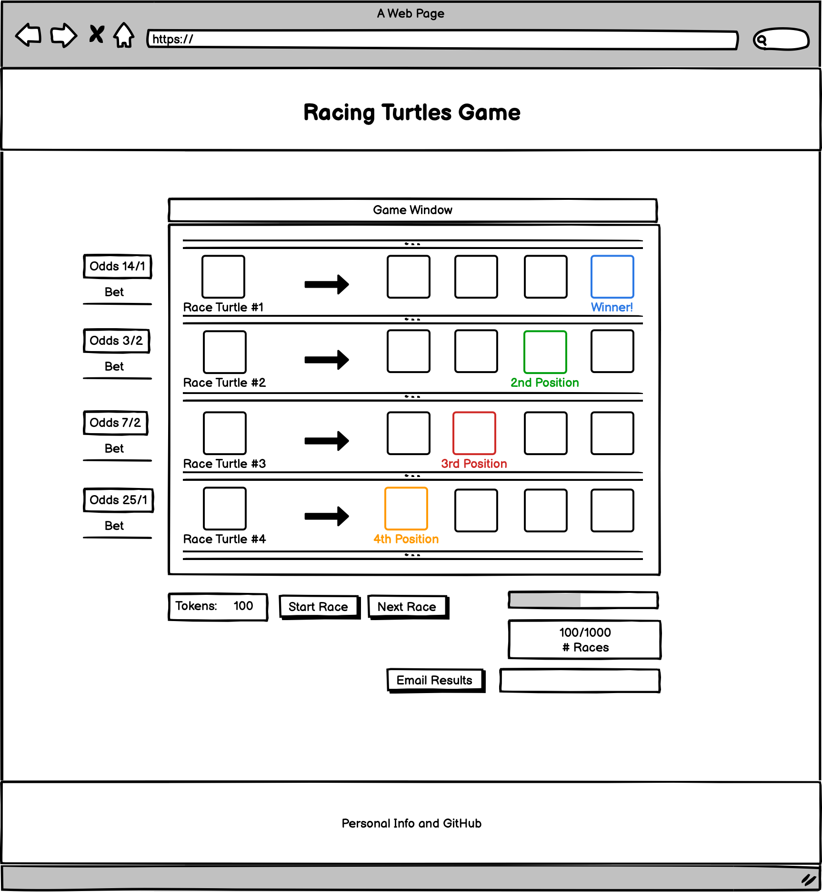
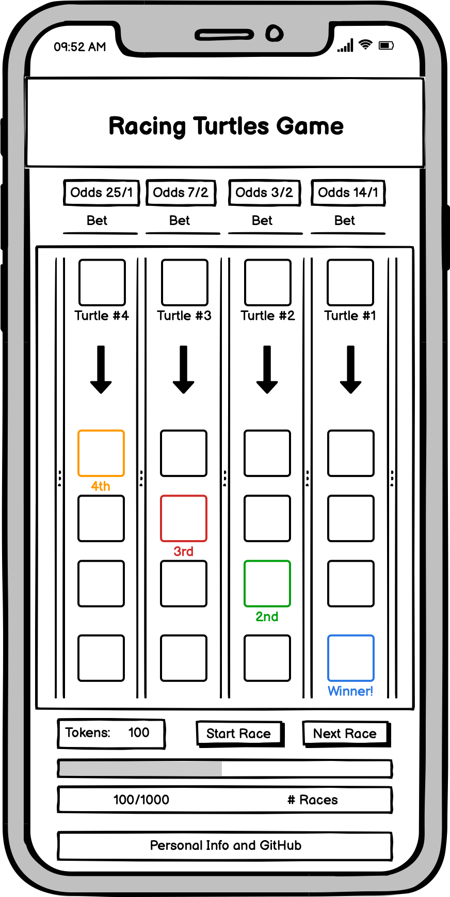

<h1 align="center">Interactive-Frontend-Development-Milestone-Project/ (Milestone Project #2)</h1>
<h1 align="center">Olly Lomax</h1>

<h2 align="center"></h2>

# Racing Turtles Website
I made this website using my knowledge of HTML5, CSS3, JavaScript, jQuery and Bootstrap frameworks as well as UX Design which I have learned from Code Institute during my Diploma in Full Stack Software Development. I made this interactive game with the intention of completing my Interactive Frontend Development Milestone Project. From scope to testing has taken me just under 10 days.

View the live project [here](https://ollylomax.github.io/Racing-Turtles---Interactive-Frontend-Development-Milestone-Project/index.html).

To show what I have learned so far with HTML5, CSS, Bootstrap, jQuery and Javascript.
To provide a fun and interactive game to play that users will enjoy.
To show clear win and lose scenarios.
To make a game that users will want to play multiple times.
To make a game that users will want to return to the website in order to play again.

## STRATEGY

- ### User Stories

    - As a user, I want to easily understand the purpose of the site.

    - As a user, I want to clearly view the website and content on any device.

    - As a user, I want to clearly view the website and content on any browser.

    - As a user, I want to be able to understand how the game works with clear instructions.

    - As a user, I want to see the odds clearly displayed for each turtle.

    - As a user, I want to choose the turtle I want to bet on based on odds, name and portrait.

    - As a user, I want to be able to easily bet on my chosen turtle.

    - As a user, I want to be warned if I forgot to input a bid before starting the race.

    - As a user, I want to be able to see how many tokens I have remaining.

    - As a user, I want to be able to quickly and easily start the race.

    - As a user, I want to be able to clearly see where the turtles have finished in each race.

    - As a user, I want to see my tokens update after each race.

    - As a user, I want to be able to see if I win my bet, and how many tokens I won.

    - As a user, I want to be able to see if I lose my bet, and how many tokens I lost.

    - As a user, I want to be able to visually see how many tokens I need to win the game.

    - As a user, I want to be able to quickly and easily move on to the next race.

    - As a user, I want to be alerted when I win or lose the game.

    - As a user, I want to be able to quickly start a new game.

## STRATEGY

- ### Planned Features

    - Page heading and logo to be visually appealing and provide a short description of what the game is about.
    - An interactive turtle racing game using imaginary tokens to bet with.
    - Clear instructions on how to play the game.
    - Randomised turtle portraits and names
    - Randomised betting odds with correctly weighted race outcomes
    - Input field for each turtle to place bets within, with restrictions on input
    - Start race button.
    - Finishing positions displayed clearly with turtle icons in the respective lanes.
    - User tokens value displayed clearly.
    - Visual progress bar showing progress towards winning scenario.
    - Shake effect on user tokens value when value changes with bets
    - Next race button.
    - Alert popup to tell user if they have forgotten to input a bet.
    - Clearly display which turtle has won the race and If the turtle the user bet on won or lost
    - Clearly display token gains and losses through betting outcomes
    - Modal dialogs announcing Win/Loss scenarios to the user.
    - GitHub profile and repos shown in footer.

## STRUCTURE

### User Story:
> As a user, I want to easily understand the purpose of the site.

- #### Acceptance Criteria:
    - Aesthetically pleasing logo of a turtle displayed.
    - Heading displayed with ’Racing Turtles’.
    - Sub-heading displayed with ‘Bet on Turtles and try to reach 1000 Tokens!’

 - #### Description:
    The logo, page heading and sub-heading clearly display to users the main purpose of the webpage immediately on page load.

### User Story:
> As a user, I want to clearly view the website and content on any device.

- #### Acceptance Criteria:
    - The layout of the website is well structured, clearly readable and aesthetically pleasing across all viewports and devices.

- #### Description:
    Utilising rows and columns within Bootstrap frameworks and mobile first design will be used when coding the project and testing will be required to ensure the layout is clear on all devices. No elements should overlap their containers and all items should be responsive so that no elements are too large to display properly.

### User Story:
> As a user, I want to be able to understand how the game works with clear instructions.

- #### Acceptance Criteria:
    Instructions will be shown to the user before any action in required.

 - #### Description:
    Itemised game instructions outlined in results box before each race has been initiated.

### User Story:
> As a user, I want to see the odds clearly displayed for each turtle.

- #### Acceptance Criteria:
    User can clearly see the odds for each turtle to be able to make a decision on their bet.

 - #### Description:
    Random odds will be generated and shown for each turtle beneath their portrait and above their race lane.

### User Story:
> As a user, I want to choose the turtle I want to bet on based on odds, name and portrait.

- #### Acceptance Criteria:
    User will be shown a picture of the turtle, his/her name and betting odds ii order for them to be comfortable with their choice.

 - #### Description:
    Turtle portraits and names will be randomly assigned to each name and be clearly displayed alongside their respective odds to win the race.

### User Story:
> As a user, I want to be able to easily bet on my chosen turtle.

- #### Acceptance Criteria:
    User able to discern the the betting box relevant to the turtle they wish to bet on and input the tokens they wish

 - #### Description:
    Input fields will be provided and clearly displayed beneath the portrait, name and odds of the relevant turtle.

### User Story:
> As a user, I want to be warned if I forgot to input a bid before starting the race.

- #### Acceptance Criteria:
    User will be alerted if they try to start a race without making a bet on a turtle

 - #### Description:
    An alert dialog will pop on screen if the start race button is clicked without a betting input

### User Story:
> As a user, I want to be able to see how many tokens I have remaining.

- #### Acceptance Criteria:
    User will be shown the total amount of tokens they have at all stages throughout the game.

 - #### Description:
    A box containing an interactive display of user tokens is displayed underneath the game window in bold.

### User Story:
> As a user, I want to be able to quickly and easily start the race.

- #### Acceptance Criteria:
    User can initiate the race to begin

 - #### Description:

    ’Start Race’ button will be provided underneath the game window.

### User Story:
> As a user, I want to be able to clearly see where the turtles have finished in each race.

- #### Acceptance Criteria:
    User can see on the race track where each turtle finished in the race

 - #### Description:
    In each lane the turtle icons are displayed in the position in which they finished the race, from 1st to 4th.

### User Story:
> As a user, I want to see my tokens update after each race.

- #### Acceptance Criteria:
    User’s attention will be directed towards their tokens value when a race is complete

 - #### Description:
    User tokens value will shake with a css effect and briefly change colour corresponding to gaining (green) or losing (red) tokens
after a race has finished.

### User Story:
> As a user, I want to be able to see if I win my bet, and how many tokens I won.
> As a user, I want to be able to see if I lose my bet, and how many tokens I lost.

- #### Acceptance Criteria:
    User will be clearly informed of race outcome, including winning turtle, whether their turtle won as well as exact token gains and losses.

 - #### Description:
    A results box is provided for the user which displays:

    - The winning turtle
    - Whether the turtle the user bet on won
    - If their turtle won, the amount of tokens gained is shown
    - If their turtle didn’t win, the amount of tokens lost is shown

### User Story:
> As a user, I want to be able to visually see how many tokens I need to win the game.

- #### Acceptance Criteria:
    User will be shown current progression towards winning the game both informatively and visually

 - #### Description:
    Textual values are shown beneath the game window of current tokens compared to the 1000 tokens required to win the game.

    An interactive progression bar is also shown in the same position, giving the user a visual representation of progress towards a winning outcome.

### User Story:
> As a user, I want to be able to quickly and easily move on to the next race.

- #### Acceptance Criteria:
    User can move onto the next race to decide on their next bet

 - #### Description:

    A ’Next Race’ button replaces the ‘Start Race’ button after it is clicked underneath the game window.

### User Story:
> As a user, I want to be alerted when I win or lose the game.

- #### Acceptance Criteria:
    User will be alerted when their win or lose the game.

 - #### Description:
    Modal popups are initiated when winning or losing scenarios have been met, informing the user of the outcome.

### User Story:
> As a user, I want to be able to quickly start a new game.

- #### Acceptance Criteria:
    After a game as been won or lost, user will easily be able to restart the game to play again.

 - #### Description:
    Restart button provided on modal popups which restarts the game completely. Closing the modals using the ‘x’ at the top right has the same effect.

## SKELETON

- ### Wireframes

    - Home (desktop)
    

    - Home (mobile)
    

## SKELETON

- ### Colour Scheme

I used three main colours for the website. A cyan for the main theme, as well as black and white for contrast. I felt like they complimented each other well, related well to the turtle theme and provided the necessary contrast to use exclusively throughout the design process.

- ### Typography
I used two main fonts for the website, Odibee for the main heading for a gaming feel and Roboto for all content which is well recognised and a standard in web design.

- ### Imagery
I sourced the Racing Turtles main logo, the turtle race icons and the race background from licensed images on a Shutterstock free trial which are free for personal and commercial use. The turtle portrait images were taken from Unsplash which is a free resource for stock images. Using my knowledge of Adobe Photoshop and Illustrator, all images have been selected and edited/exported with as much uniformity as possible and downsampled to decrease page load times.

Notable amendments to Design

In contrast to my wireframes, I decided to keep the flow of race tracks in a vertical direction for both desktop and mobile. The reasons for this were twofold:

- The heavy css and html changes required would not have been a productive use of time on an already tight schedule.
- Upon reflection, I liked the flow of the race track in its current state on desktop and realised changing it would be unnecessary having already showcased my solid understanding of media queries in my previous project.

In contrast to my wireframes, I decided not to include the ‘Email Results’ email input in the desktop site. I had intended to hook this up to an API where the user, upon winning the game, could request a basic email showing how many tokens they won and how many races it took. The reasons for this were twofold:

- I had already coded a walkthrough project where I hooked up a simple email API and felt that this wasn’t going to showcase any further skills.
- I felt that this feature did not have any other purpose other than to show I can hook up a basic email API, and that it did not tie in with the theme of the site.

Functional Limitations
Having not begun JavaScript on the course yet, all form actions on the site are directed to a Code Institute form dump I used during the learning process. Therefore no data is stored from POST method on form submission.

Features
Current

Responsive across all viewports using bootstrap classes.
Page heading and logo
Clear instructions on how to play the game.
Turtle portrait and names
Correctly weighted odds for each turtle
User inputs with restrictions
Start race and Next race buttons.
Turtle icons in start positions in respective lanes.
Turtle icons in finishing positions in respective lanes. (Upon clicking Start Race button)
User tokens and progress towards the winning scenario of 1000 tokens.
Progress bar towards aforementioned winning scenario.
User token shake effect (Upon the gaining or losing of Tokens)
Alert popup teller user to place a bet (If no bets are input)
Textual results informing user about race winner and tokens lost/gained
Modal dialogs telling user they have won/lost (Upon winning/losing scenarios)
Footer - GitHub profile and links to my repos

Prospective

Animate the turtles down their lanes, setting varying interval steps for each turtle.
The project is future scoped for the easy addition of more lanes and more turtles.
Change Win/Loss scenario from reaching a set number of tokens, to playing against the ‘computer’ with randomised choices.

Testing

- As a user, I want to easily understand the purpose of the site.

Open website, purpose of game displayed in subheading. Instructions displayed in results box next to start game button.

- As a user, I want to clearly view the website and content on any device.

Open website on all viewport sizes and test whether content overlaps all the way down to 300px.

- As a user, I want to clearly view the website and content on any browser.

Open website on Google Chrome, Mozilla Firefox and Safari and check for consistency between browsers.

- As a user, I want to be able to understand how the game works with clear instructions.

Open website, purpose of game displayed in subheading. Instructions displayed in results box next to start game button.

- As a user, I want to see the odds clearly displayed for each turtle.

Open website, odds displayed in correct format underneath each turtle portrait.

- As a user, I want to choose the turtle I want to bet on based on odds, name and portrait.

Open website, turtle pictures and turtle names shown above corresponding race lane.

- As a user, I want to be able to easily bet on my chosen turtle.

Open website, click on random input box and input a number of tokens within total tokens value

Open website, click on random input box and input a number of tokens over total tokens value

Open website, click on random input box and input 0

Open website, click on random input box and try to input a negative value with ‘-‘.

- As a user, I want to be warned if I forgot to input a bid before starting the race.

Open website, click on ‘Start Race’ button

Open website, click on random input box and press ‘Enter’ on keyboard.

- As a user, I want to be able to see how many tokens I have remaining.

Open website, tokens clearly displayed beneath the game window.

- As a user, I want to be able to quickly and easily start the race.

Open website, click on random input box and input number not exceeding total tokens value. Click on ‘Start Race’ button.

As a user, I want to be able to clearly see where the turtles have finished in each race.

As a user, I want to see my tokens update after each race.

As a user, I want to be able to see if I win my bet, and how many tokens I won.

As a user, I want to be able to see if I lose my bet, and how many tokens I lost.

As a user, I want to be able to visually see how many tokens I need to win the game.

As a user, I want to be able to quickly and easily move on to the next race.

As a user, I want to be alerted when I win or lose the game.

As a user, I want to be able to quickly start a new game.

